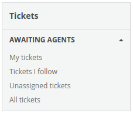

Columns/Column
==============
A navigation column containing expandable drawers.

* [Overview](#overview)
* [Props](#props)
* [CSS](#css)
* [Examples](#examples)


```jsx
<Column>
  <Heading>
    <Icon name="envelope"/>
    Tickets
  </Heading>
  <DrawerList>
    <Drawer>
      <Heading>
        My Stars
      </Heading>
      <ItemList>
        <Item>
          Bug
          <Count>1</Count>
        </Item>
        <Item>
          Green
          <Count>0</Count>
        </Item>
        <Item>
          Yellow
          <Count>3</Count>
        </Item>
      </ItemList>
    </Drawer>
  </DrawerList>
</Column>
```

### Overview
Semantically the column is an unordered list `<ul>` containing one or more list items `<li>`. Where each list item represents a "drawer" which may be opened or closed. For example:

```html
<div class="column">
  <h2>Tickets</h2>
  <ul class="drawer-list">
    <li class="drawer">
      Bug
    </li>
    <li class="drawer">
      Green
    </li>
  </ul>
</div>
```

Each column begins with the `Columns/Column` component, a `Common/Heading`, a `Columns/DrawerList`, and one or more `Columns/Drawer` components. All of which are optional.

```jsx
import React from 'react';
import { Heading } from 'Components/Common';
import { Column, DrawerList, Drawer } from 'Components/Columns';

class App extends React.Component {

  render() {
    return (
      <Column>
        <Heading>
          Tickets
        </Heading>
        <DrawerList>
          <Drawer />
          <Drawer />
          <Drawer />
        </DrawerList>
      </Column>
    )
  }
}
```

Anything can be added to drawers, including forms, images, and lists of items. We'll use the `Columns/ItemList` and `Columns/Item` components to add lists of items to the first drawer. We'll also give the drawer an optional heading using the `Common/Heading` component.

```jsx
import React from 'react';
import { Heading } from 'Components/Common';
import {
  Column,
  DrawerList,
  Drawer,
  ItemList,
  Item
} from 'Components/Columns';

class App extends React.Component {

  render() {
    return (
      <Column>
        <Heading>
          Tickets
        </Heading>
        <DrawerList>
          <Drawer>
            <Heading>
              Awaiting Agents
            </Heading>
            <ItemList>
              <Item>
                My tickets
              </Item>
              <Item>
                Tickets I follow
              </Item>
              <Item>
                Unassigned tickets
              </Item>
              <Item>
                All tickets
              </Item>
            </ItemList>
          </Drawer>
        </DrawerList>
      </Column>
    )
  }
}
```

At this point you have a fully functioning column with drawers which should look like this.



_Note: An icon to toggle the drawer opened and closed is automatically added to each drawer._

### Props

**role={bool}**  
The aria role.

### CSS
Adds `dp-column` class to the column container.

### Examples

```jsx
import React from 'react';
import { render } from 'react-dom';
import { Heading, Count } from 'Components/Common';
import {
  Column,
  DrawerList,
  Drawer,
  ItemList,
  Item
} from 'Components/Columns';

const styles = {
  iconEnvelope: {
    color: '#59a8e2'
  },
  iconBlue: {
    color: '#4696DC'
  },
  iconGreen: {
    color: '#54c66a'
  },
  iconYellow: {
    color: '#f9d6a4'
  }
};

class App extends React.Component {

  render() {
    return (
      <Column className="dp-column__first">
        <Heading>
          Tickets
          <Icon name="envelope-o" style={styles.iconEnvelope} />
        </Heading>
        <DrawerList>
          {this.renderDrawerAgents()}
          {this.renderDrawerSearches()}
          {this.renderDrawerProblems()}
          {this.renderDrawerStars()}
          {this.renderDrawerLabels()}
        </DrawerList>
      </Column>
    )
  }

  renderDrawerAgents() {
    return (
      <Drawer>
        <Heading>
          Awaiting Agent
        </Heading>
        <ItemList>
          <Item>
            My tickets
            <Count>1</Count>
          </Item>
          <Item>
            Tickets I follow
            <Count>0</Count>
          </Item>
          <Item>
            Unassigned tickets
            <Count>0</Count>
          </Item>
          <Item>
            All tickets
            <Count>99</Count>
          </Item>
        </ItemList>
      </Drawer>
    )
  }

  renderDrawerSearches() {
    return (
      <Drawer>
        <Heading>
          Saved Searches
        </Heading>
        <Subheading>
          Subheading
        </Subheading>
        <ItemList>
          <Item>
            My weekly mentions
            <Count>2</Count>
          </Item>
        </ItemList>
      </Drawer>
    )
  }

  renderDrawerProblems() {
    return (
      <Drawer opened={false}>
        <Heading count={2}>
          Problems &amp; Incidents
        </Heading>
        <ItemList>
          <Item>
            Elastic search indexes
            <Count>2</Count>
          </Item>
          <Item>
            Inability to use iOS app
            <Count>18</Count>
          </Item>
        </ItemList>
      </Drawer>
    )
  }

  renderDrawerStars() {
    return (
      <Drawer opened={false}>
        <Heading>
          My Stars
        </Heading>
        <ItemList>
          <Item>
            Bug
            <Count>1</Count>
            <Icon name="star" style={styles.iconBlue} />
          </Item>
          <Item>
            Green
            <Count>1</Count>
            <Icon name="star" style={styles.iconGreen} />
          </Item>
          <Item>
            Yellow
            <Count>3</Count>
            <Icon name="star" style={styles.iconYellow} />
          </Item>
        </ItemList>
      </Drawer>
    )
  }

  renderDrawerLabels() {
    return (
      <Drawer opened={false}>
        <Heading>
          Labels
        </Heading>
        <ItemList>
          <Item>
            
          </Item>
        </ItemList>
      </Drawer>
    )
  }
}

render(<App />, document.getElementById('mount'));
```


