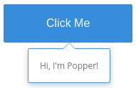

Common/Popper
=============
A wrapper around [popper.js](https://popper.js.org), a tooltip style container which uses absolute positioning to place elements relative to other elements.



```jsx
<div>
    <button id="my-button">
        Click Me
    </button>
    <Popper target="my-button" placement="bottom">
        Hi, I'm Popper!
    </Popper>
</div>
```

### Props

**target={string|function|element}**  
Specifies which element where the popper will be positioned. Possible values:

* string: The ID of the target element.
* element: Reference to the target element.
* function: Returns the target as an HTMLElement.

**placement={string}**  
Specifies where to place the popper in relation to the target element. Possible values:

* One of: 'auto', 'auto-start', 'auto-end', 'top', 'top-start', 'top-end', 'right', 'right-start', 'right-end', 'bottom', 'bottom-start', 'bottom-end', 'left', 'left-start', or 'left-end'.

**offsetX={number|string}**  
Shifts the popper on its X axis. Possible values:

* number: The offset value in pixels.
* string: The offset value as a unit. Valid units are 'px', '%', '%r', '%p', 'vw', and 'vh'.

**offsetY={number|string}**  
Shifts the popper on its Y axis. Possible values:

* number: The offset value in pixels.
* string: The offset value as a unit. Valid units are 'px', '%', '%r', '%p', 'vw', and 'vh'.

**opened={bool}**  
True to display the popper or false to hide it.

**arrow={bool}**  
Whether an arrow is added to the popper.

**eventsEnabled={bool}**  
Add resize/scroll events and recalculate position of the popper when they are triggered. Set to false by default for performance reasons.

**preventOverflow={bool}**  
Prevents the popper from being positioned outside the boundary. The `eventsEnabled` prop should be set to true when using this prop.

**detached={bool}**  
True to attach the popper to the document.body. The `eventsEnabled` prop should be set to _true_ when using this prop.

**closeOnClickOutside={bool}**  
Close the popper when the user clicks outside of it.

**onCreate={func}**  
Called when the internal popper.js instance is created.

**onUpdate={func}**  
Called when the internal popper.js instance is updated.

**onOpen={func}**  
Called when the popper is opened.

**onClose={func}**  
Called when the popper is closed.

### Methods
**open([target])**  
Opens the popper. When given the popper will use the `target` parameter as the target element.

**close([target])**  
Closes the popper. When given the popper will use the `target` parameter as the target element.

**toggle([target])**  
Toggles the popper opened or closed. When given the popper will use the `target` parameter as the target element.

### Examples

This example creates a popper and uses a button to toggle it opened and closed. The popper will become attached to the button by passing the button instance (e.g. `this`) to the `popper.toggle()` method.

```jsx
import React from 'react';
import PropTypes from 'prop-types';
import { render } from 'react-dom';
import { Popper } from 'Components/Common';

class Button extends React.Component {
  render() {
    const { popper, children, ...props} = this.props;
    
    return (
      <button {...props} onClick={() => popper.toggle(this)}>
        {children}
      </button>
    )
  }
}

class App extends React.Component {
  render() {
    return (
      <div>
        <Button popper={this.popper}>
          Click Me
        </Button>
        <Popper
          ref={ref => (this.popper = ref)}
          opened={false}
          arrow={true}
          eventsEnabled={true}
          detached={true}
          placement="bottom"
        >
          <p>
            Hi, I'm Popper!
          </p>
        </Popper>
      </div>
    )
  }
}

render(<App />, document.getElementById('mount'));
```
